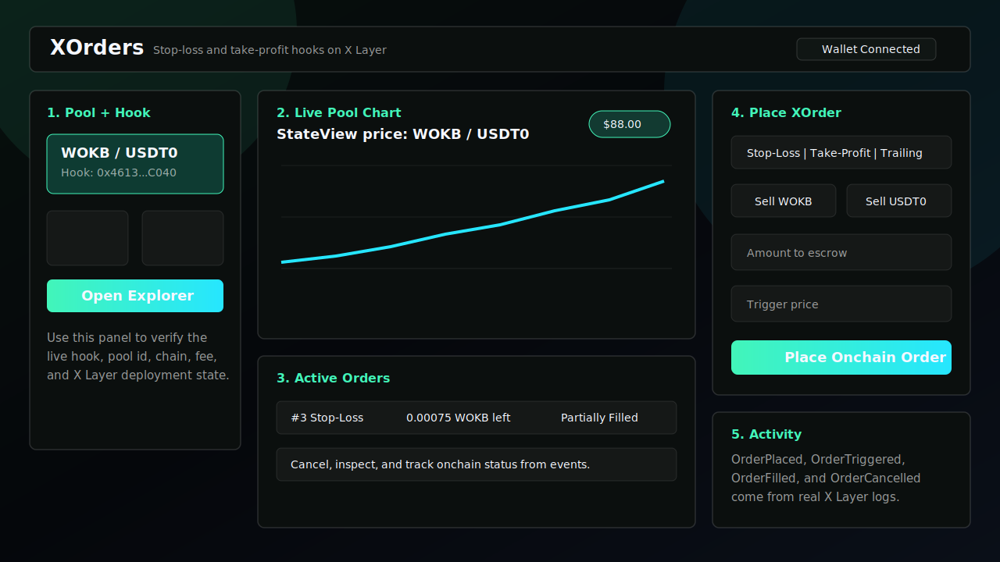
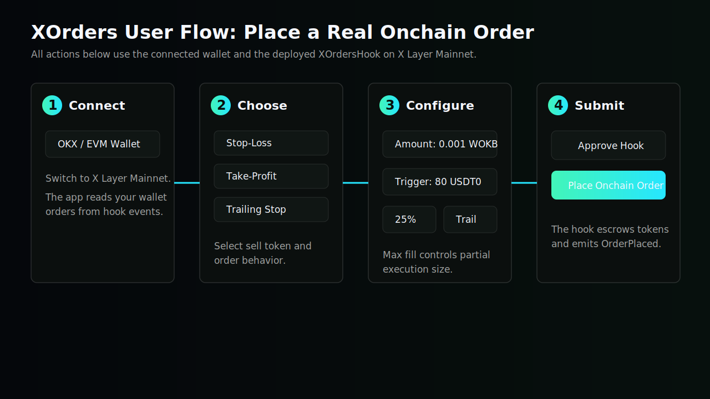
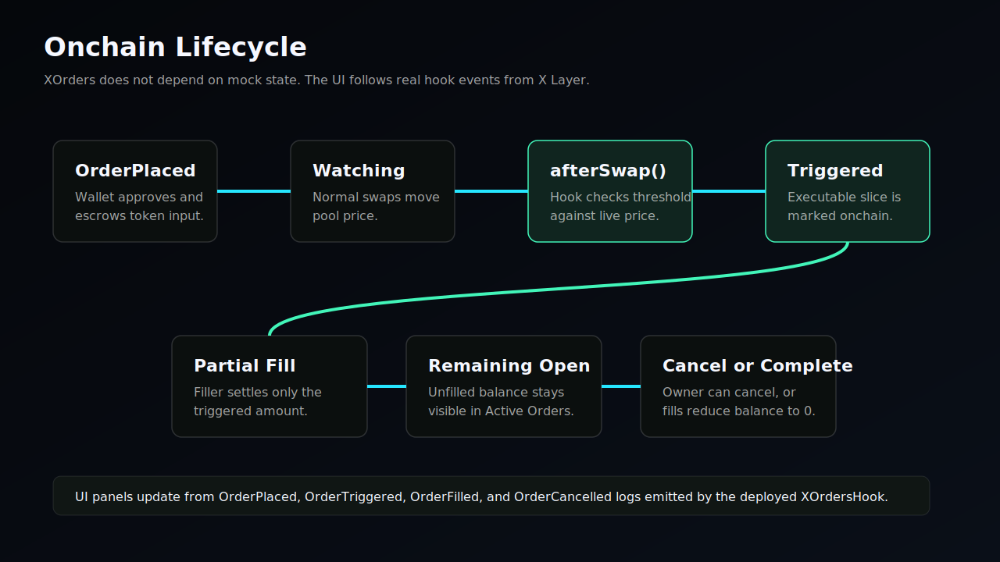

# XOrders

**On-chain Stop-Loss & Take-Profit Orders directly inside Uniswap v4 pools on X Layer Mainnet.**

XOrders is a Uniswap v4 hook project for the X Layer Build X Hackathon. Users escrow tokens into a pool-specific hook, define stop-loss or take-profit thresholds, and let normal swap flow trigger order state transitions through `afterSwap()`.

The key idea: price discovery already happens inside the pool. XOrders lets the pool itself become the order trigger surface.

## What It Builds

- A dark, responsive Next.js trading dashboard in `frontend/`
- A Foundry-based Uniswap v4 hook package in `contracts/`
- One hook contract supporting stop-loss, take-profit, trailing-stop metadata, multiple orders per wallet, partial trigger quantities, cancelation, and frontend-indexable events
- X Layer Mainnet deployment wiring for Chain ID `196`

## Hook Innovation

Most stop-loss systems depend on centralized exchange order books or offchain bots watching prices. XOrders moves the threshold detection into a Uniswap v4 `afterSwap()` hook:

1. Users create escrow-backed orders against a specific v4 pool.
2. Every pool swap updates the observed pool price.
3. If the price crosses an order threshold, `afterSwap()` marks an executable slice of that order and emits `OrderTriggered`.
4. A keeper, UI executor, or future settlement adapter can fill the triggered slice without guessing whether the order condition was met.

This keeps trigger truth onchain and pool-native while avoiding unsafe recursive swaps from inside the hook callback.

## Repository Layout

```txt
.
├── frontend/          # Next.js 14 App Router dashboard
├── contracts/         # Foundry Uniswap v4 hook package
├── .env.example
└── README.md
```

## X Layer Mainnet

- Chain ID: `196`
- RPC: `https://rpc.xlayer.tech`
- Alternate RPC: `https://xlayerrpc.okx.com`
- Explorer: `https://www.okx.com/web3/explorer/xlayer`
- Uniswap v4 PoolManager: `0x360e68faccca8ca495c1b759fd9eee466db9fb32`
- Uniswap v4 PositionManager: `0xcf1eafc6928dc385a342e7c6491d371d2871458b`
- Uniswap v4 StateView: `0x76fd297e2d437cd7f76d50f01afe6160f86e9990`
- Uniswap Universal Router: `0xda00ae15d3a71466517129255255db7c0c0956d3`

## Frontend

```bash
cd frontend
npm install
npm run dev
```

Open `http://localhost:3000`.

The UI is live-data first. It reads the deployed hook, pool id, and deploy block from `.env.local`:

```bash
NEXT_PUBLIC_XORDERS_HOOK_ADDRESS=...
NEXT_PUBLIC_XORDERS_POOL_ID=...
NEXT_PUBLIC_XORDERS_DEPLOY_BLOCK=...
```

## Platform User Guide

XOrders has two main surfaces:

- Landing page `/`: project overview, deployed-network context, and Launch App entry point.
- Trading app `/app`: live pool chart, order ticket, wallet orders, and hook event activity.

### Dashboard Map



1. **Pool + Hook panel**: confirms the live WOKB / USDT0 market, hook address, PoolManager, StateView, deploy block, fee tier, and X Layer chain id.
2. **Live pool chart**: reads the configured v4 pool price from `StateView`. This is not mock chart data.
3. **Active Orders**: shows real wallet-owned orders indexed from `OrderPlaced`, `OrderTriggered`, `OrderFilled`, and `OrderCancelled` logs.
4. **Place XOrder ticket**: creates real escrow-backed stop-loss, take-profit, or trailing-stop orders through the deployed hook.
5. **Activity panel**: shows recent hook events with explorer links for transaction verification.

### How To Place An Order



1. Connect an injected EVM wallet such as OKX Wallet or MetaMask.
2. Make sure the wallet is on X Layer Mainnet, Chain ID `196`.
3. Open `/app` and confirm the Pool + Hook panel shows:
   - Hook: `0x461332830E361576D7E0A9F2675FD202Ee49C040`
   - Market: `WOKB / USDT0`
   - Pool ID: `0x3e86941d6d3a4ae9ea7adb16e510d13d987c164fcd554abbff486b060ec60cb3`
4. In the order ticket, choose the order type:
   - **Stop-Loss**: triggers when price moves against your position.
   - **Take-Profit**: triggers when price reaches your profit target.
   - **Trailing Stop**: adjusts the trigger as the market moves in your favor.
5. Choose the sell side:
   - **Sell WOKB** if you want to escrow WOKB and receive USDT0 when triggered.
   - **Sell USDT0** if you want to escrow USDT0 and receive WOKB when triggered.
6. Enter amount, trigger price, max fill percent, and optional trailing percent.
7. Click **Approve Hook** so the hook can escrow the selected token.
8. Click **Place Onchain Order** and confirm the wallet transaction.
9. After confirmation, the order appears in Active Orders once the hook log is indexed.

### Order Lifecycle



The order lifecycle is fully onchain:

1. `OrderPlaced`: the hook escrows the input token and records the trigger.
2. `afterSwap()`: each real v4 pool swap lets the hook compare the current pool price with open thresholds.
3. `OrderTriggered`: when the price crosses the threshold, the hook marks a fillable slice.
4. `OrderFilled`: a keeper, UI executor, or settlement flow fills triggered liquidity.
5. Remaining balance stays open for partial execution, or the owner can cancel the order.

### Reading Active Orders

The Active Orders table shows:

| Column | Meaning |
| --- | --- |
| Order | Onchain order id emitted by the hook |
| Type | Stop-Loss, Take-Profit, or Trailing Stop |
| Owner | Wallet that created the order |
| Amount | Original escrowed input amount |
| Trigger | Human-readable trigger price in USDT0 per WOKB |
| Remaining | Input amount still available after partial fills |
| Status | Open, Triggered, Partially Filled, Filled, or Cancelled |

### Common User Notes

- If orders do not appear instantly, wait for the X Layer RPC indexer pass. The frontend scans logs in small batches because the public RPC limits `eth_getLogs` to 100 blocks per request.
- If the chart says no pool, check `NEXT_PUBLIC_XORDERS_POOL_ID` in Vercel or `.env.local`.
- If the order buttons are disabled, connect a wallet and ensure the wallet is on X Layer Mainnet.
- If approval succeeds but order placement fails, confirm the token balance and the exact sell token selected in the order ticket.

## Contracts

Install Foundry, then:

```bash
cd contracts
forge install
forge build
forge test
```

Deploy to X Layer Mainnet:

```bash
cp ../.env.example .env
# fill PRIVATE_KEY, POOL_MANAGER, POSITION_MANAGER, HOOK_SALT
forge script script/DeployXOrders.s.sol:DeployXOrders \
  --rpc-url https://rpc.xlayer.tech \
  --chain-id 196 \
  --broadcast \
  --verify
```

Create a live pool with the deployed hook and real X Layer ERC20 token addresses:

```bash
cd contracts
set -a
source ../.env
set +a
forge script script/CreatePool.s.sol:CreatePool \
  --rpc-url "$XLAYER_RPC_URL" \
  --chain-id 196 \
  --broadcast
```

The script prints the real pool id. Add it to `frontend/.env.local` as `NEXT_PUBLIC_XORDERS_POOL_ID`.

## Contract Addresses

| Component | Address |
| --- | --- |
| XOrdersHook | `0x461332830E361576D7E0A9F2675FD202Ee49C040` |
| WOKB / USDT0 Pool ID | `0x3e86941d6d3a4ae9ea7adb16e510d13d987c164fcd554abbff486b060ec60cb3` |
| PoolManager | `0x360e68faccca8ca495c1b759fd9eee466db9fb32` |
| PositionManager | `0xcf1eafc6928dc385a342e7c6491d371d2871458b` |
| StateView | `0x76fd297e2d437cd7f76d50f01afe6160f86e9990` |
| UniversalRouter | `0xda00ae15d3a71466517129255255db7c0c0956d3` |

Transactions:

- Hook deploy tx: `0x3bf14f47f01472c4ae201606dbe5bcd2c50c9f7470bfbf258de90df1a759b2db`
- Pool initialize tx: `0xb43465180c209148d299e303b97ad97b36fb7bc2362e998effd61a02e0371d67`
- Liquidity mint tx: `0x4b31b7908c755d82d12090d25e13e1876f02c01a9d4970c77896c55b0aff9782`
- OrderPlaced tx: `0x9a8cd5f08ff7cdb1e6d74c00ad871cae27f718c752ec28f4e66b4740469c26e1`
- Triggering swap tx: `0x204599d4fc2a4b76d2b9be38b90d1402b7fecbd2d4a1b54879a8e974ac85553d`
- OrderFilled tx: `0xc5ce7f58d867312b44646fff91bbeaaa305cbcb940d5b0c3effc98d247e28355`
- Live order id: `3`

## Submission Checklist

See `SUBMISSION.md` for the final Build X checklist, deployed addresses, verification notes, and remaining off-repo tasks.

## Hackathon Demo Script

1. Connect OKX Wallet or any injected EVM wallet on X Layer.
2. Create or select a v4 pool using the XOrders hook.
3. Place a take-profit order above current price and a stop-loss order below current price.
4. Execute real swaps through the configured pool until the chart crosses the threshold.
5. Show `OrderTriggered` in the activity panel and explorer logs.
6. Cancel or partially fill the remaining order.

## Important Security Notes

This repository is a production-quality hackathon implementation, not an audited protocol. Before holding real user funds, complete an external audit, integrate a hardened settlement adapter, validate deployed Uniswap v4 addresses for X Layer, and add keeper incentive controls.

## Sources

- X Layer Build X Hook requirements: https://web3.okx.com/xlayer/build-x-hackathon/hook
- Uniswap v4 hooks docs: https://developers.uniswap.org/docs/protocols/v4/concepts/hooks
- Uniswap v4 swap hook guide: https://developers.uniswap.org/docs/protocols/v4/guides/hooks/swap-hooks
